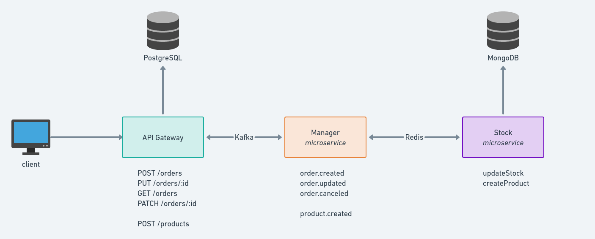

# back-end test saude-id

[](https://insomnia.rest/run/?label=Teste%20SaudeId&uri=https%3A%2F%2Fgithub.com%2Fmicaelcc%2Ftest-saudeid%2Fblob%2Fmain%2Fdocs%2Fapi-gateway-routes.json)

## Serviços



## Descrição

    O sistema tem como objetivo fornecer uma API que contenha rotas para criação/edição/cancelamento de pedidos.
    Além disso, existem dois microserviços que auxiliam no processo de atualização do estoque, o serviço stock,
    que contém um banco de dados MongoDb e recebe chamadas via Redis para atualização do estoque, e o serviço
    manager, que atua fazendo intermédio entre a api-gateway e o sistema de estoque, processando os pedidos e
    publicando eventos via Redis para o serviço de stock fazer as modificações necessárias.

## Tecnologias

- [NestJs](https://nestjs.com/)
- [Kafka](https://kafka.apache.org/)
- [Redis](https://redis.io/)
- [Docker](https://www.docker.com/)
- [Jest](https://jestjs.io/pt-BR/)
- [TypeORM](https://typeorm.io/)
- [PostgreSQL](https://www.postgresql.org/)
- [MongoDb](https://www.mongodb.com/)
- [Mongoose](https://mongoosejs.com/)

## Rodando com Docker

### Buildar e subir containers

```bash
$ docker-compose -f docker-compose.yml up -d --build
```

## Documentação no navegador com Swagger

```
http://localhost:3000/api
```

```
ou se preferir, pode utilizar o Insomnia (lembrar de setar para 'debug' depois de importar).
```

### Rodando testes unitarios de cada serviço

##### api-gateway

```bash
docker exec -it test-saudeid_api-gateway_1 yarn test:unit
```

ou

```bash
$ cd services/api-gateway
$ yarn install
$ yarn test:unit
```

##### manager

```bash
docker exec -it test-saudeid_manager-ms_1 yarn test
```

ou

```bash
$ cd services/manager
$ yarn install
$ yarn test
```

##### stock

```bash
docker exec -it test-saudeid_stock-ms_1 yarn test
```

### Rodando testes de integração

##### Parar docker-compose da aplicação

```bash
$ docker-compose down
```

##### Criar container postgres de teste

```bash
$ docker run --name database-test -e POSTGRES_PASSWORD=database-test-pass -e POSTGRES_USER=database-test -e POSTGRES_DATABASE=database-test -p 5433:5432 -d postgres
```

##### Rodar testes

```bash
$ cd services/api-gateway
$ yarn install
$ yarn test:integration
```
